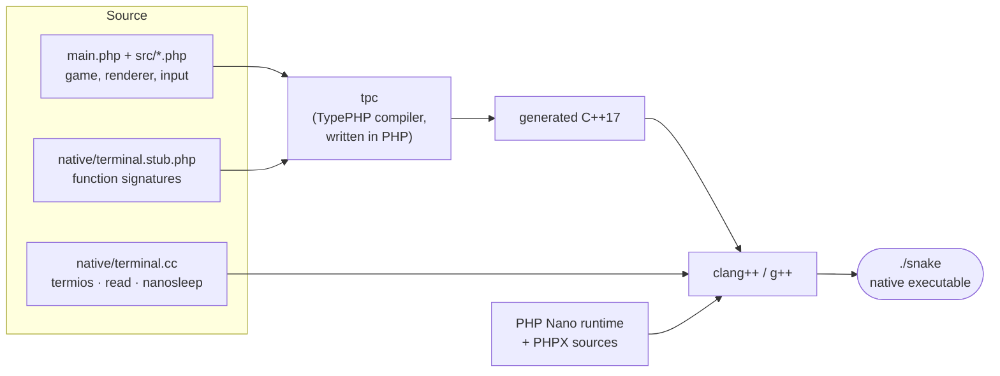

# typephp-snake

**Terminal Snake written in modern typed PHP (8.4+) and compiled ahead-of-time into a ~2 MB standalone native binary with [TypePHP](https://github.com/swoole/typephp).**
The same source also runs on the regular PHP interpreter, which makes it a small but honest testbed for PHP → C++ → machine code compilation.

[](https://github.com/NikitaSomik/typephp-snake/actions/workflows/ci.yml)


<p align="center"></p>

## Highlights

- **One binary, zero runtime dependencies.** Built with TypePHP's `--nano` mode: no `libphp`, no Zend VM, no PHP on the target machine. `otool -L snake` shows only `libc++` and `libSystem`.
- **PHP + a pinch of C++.** Game logic, rendering and input parsing are PHP. Raw terminal mode, keyboard input and the window size live in a ~220-line C++ file that PHP calls like normal functions, built only from what PHP Nano allows: `termios`, non-blocking `read()`, `nanosleep` and a cursor position report.
- **Same code on both runtimes.** `bin/snake.php` runs the game on stock PHP through a pure-PHP polyfill of that terminal API. A parity check proves both runtimes play identical games and draw byte-identical frames.
- **A real game loop.** Fixed-tick simulation, input polled with a deadline (no busy waiting), buffered turns, pause, restart, speed-up, flicker-free full-frame rendering, resize handling and Unicode or ASCII graphics.
- **Measured, not assumed.** A headless `--bench` mode, a profiling pass and a write-up of what AOT did and did not buy (see [Performance](#performance)).
- **Tested and checked.** 33 PHPUnit tests for the rules, input parser, options and renderer, a smoke test that plays the game in a pseudo-terminal, PHPStan at level max and the PER-CS coding style. CI runs all of it and builds the binary on Linux and macOS.

## Download

Prebuilt binaries are attached to every [release](https://github.com/NikitaSomik/typephp-snake/releases/latest): Linux x64 and arm64 (glibc 2.35+, e.g. Ubuntu 22.04 or newer) and macOS on Apple silicon. They need no PHP.

```bash
# pick one: snake-linux-x64, snake-linux-arm64, snake-macos-arm64
curl -fsSL https://github.com/NikitaSomik/typephp-snake/releases/latest/download/snake-macos-arm64.tar.gz | tar -xz
./snake-macos-arm64/snake
```

The macOS binary is not signed. Downloading it with `curl` as above works as is; if you download it in a browser, macOS blocks it until you run `xattr -d com.apple.quarantine snake`.

## Quick start

To build from source you need PHP 8.4 or 8.5 CLI, Composer 2, and a C/C++17 compiler (clang or gcc). No PHP embed SAPI or extra libraries are needed.

```bash
git clone https://github.com/NikitaSomik/typephp-snake.git
cd typephp-snake
composer install

make build      # PHP → C++ → ./snake  (≈20 s the first time, cached afterwards)
./snake         # play
```

| Command | What it does |
|---|---|
| `./snake --width=40 --height=20` | Custom board size (8–200) |
| `./snake --ascii` | Plain `#` `@` `o` `*` graphics |
| `./snake --autopilot` | Watch a bot play |
| `./snake --bench[=N]` | Headless benchmark with N seeded autopilot games |
| `make play-php` | Play the same code on the PHP interpreter |
| `make autopilot` / `make autopilot-php` | Watch the bot play (native / interpreter) |
| `make play ARGS="--ascii --width=40"` | Pass any game flags through make |
| `make test` | PHPUnit |
| `make analyse` | PHPStan at level max |
| `make cs` / `make cs-fix` | Check / fix the PER-CS coding style |
| `make bench` | Compare PHP, PHP + JIT and the native binary |
| `make parity` | Check that native and PHP produce identical games |
| `make smoke` | Play both versions in a pseudo-terminal and check the screen |

Controls: arrows / WASD / hjkl to move, <kbd>P</kbd> or <kbd>Space</kbd> to pause, <kbd>R</kbd> to restart, <kbd>Q</kbd> or <kbd>Ctrl+C</kbd> to quit.

## How it works



- `project.yml` lists the sources; `tpc project.yml --nano -O2` builds everything.
- TypePHP binaries start at a global `main(int $argc, array $argv)`. Top-level code is not allowed, which suits a game loop well.
- A C++ function named `php_term_read_byte` becomes the PHP function `term_read_byte()` once it is declared in a `.stub.php` file.
- PHP Nano contains no processes or signals, which rules out `stty`, `pcntl` and `posix`, and its link-time audit rejects `poll`, `select` and `ioctl`. So the terminal layer is C++: keys come from a non-blocking `read()` with short sleeps, the window size from asking the terminal for the cursor position (`ESC[999;999H ESC[6n` → `ESC[rows;colsR`), and Ctrl+C is read as byte `0x03` in raw mode instead of arriving as a signal.

```
├── main.php                  entry point: options → benchmark or interactive game
├── src/
│   ├── Game.php              rules: movement, food, collisions, score, speed, states
│   ├── Snake.php             body as packed int cells + O(1) occupancy set
│   ├── Renderer.php          whole frame → one ANSI string, run-length colored
│   ├── KeyParser.php         raw bytes → keys (escape sequences, WASD, hjkl)
│   ├── App.php               game loop with deadline-based input polling
│   ├── Autopilot.php         greedy bot used by --autopilot and --bench
│   ├── Benchmark.php         headless, seeded, checksummed benchmark
│   └── …                     Point, Cell, Direction, Key, Options, RandomSource
├── native/terminal.cc        raw mode, keyboard, window size (C++)
├── native/terminal.stub.php  declarations TypePHP binds to the C++ code
├── polyfill/terminal.php     same API in pure PHP (stty + stream_select)
├── bin/snake.php             runs the game on the PHP interpreter
├── tests/                    PHPUnit, plus tests/tty/smoke.py that plays the game in a pseudo-terminal
└── project.yml               TypePHP build configuration
```

## Performance

`--bench` runs 200 autopilot games with a fixed seed (99,268 ticks). It times the rules alone, then the rules plus rendering every frame to a string. The checksum line is identical across all runtimes.

Apple M1 Pro, PHP 8.5.7, Apple clang 21, TypePHP `master@a178223`, `-O2`:

| Runtime | Rules only | Rules + render |
|---|---:|---:|
| PHP 8.5 interpreter | 207 k ticks/s | 45 k ticks/s |
| PHP 8.5 + OPcache JIT | **387 k ticks/s** | **99 k ticks/s** |
| TypePHP native binary | 113 k ticks/s | 34 k ticks/s |

For comparison, a pure-integer recursive `fib(32)` on the same machine:

| Runtime | Time |
|---|---:|
| PHP 8.5 interpreter | 0.167 s |
| PHP 8.5 + JIT | 0.048 s |
| TypePHP native binary | **0.012 s** (14× faster than PHP) |

**What this shows.** TypePHP is very fast when the compiler can prove types and lower code to plain C++ (`int64_t`, `double`, direct calls). This game is a different workload: many short-lived objects, PHP arrays and string building. Profiling the binary with `sample` showed most of the time going to `php::Variant` construction and destruction, `zend_hash_*` and `concat_function`. The generated C++ goes through the same Zend runtime routines as the interpreter, plus some temporary zval copies. Most time lands in shared runtime code, so AOT has little to gain here, and the JIT, which specializes the hot loop, comes out ahead.

Changes that helped **both** runtimes, some a lot more for the binary:

1. Snake body stored as packed `int` cells instead of `Point` objects.
2. Rendering from a flat int grid with run-length `str_repeat` instead of per-cell concatenation.
3. `(int)` casts on array reads in hot loops. The cast is a no-op for PHP, but it tells TypePHP the element type, so `$kind` becomes a native `int64_t` instead of a dynamic `php::Var`. Visible directly in the generated C++.

Overall, rendering throughput went from 12 k to 34 k ticks/s for the binary and from 22 k to 45 k ticks/s for PHP.

## Notes from the TypePHP frontier

TypePHP is young, and most of the time here went into finding out what works. Everything below was reproduced in September 2026 (the first row with the tagged releases, the rest on the pinned `master` commits):

| Finding | Workaround used |
|---|---|
| With the tagged releases (`typephp` v0.8.1 + `php-nano` v1.0.1), the standard extension was not registered in Nano builds. Calls such as `array_unshift()` and `array_pop()` compiled, then failed at runtime with *function is undefined*. | Pinned `dev-master` of `typephp`, `php-nano` and `phpx` in `composer.lock` |
| Reading an `enum` case crashes a Nano binary (null dereference in `zend_enum_get_case`). | `final class Direction` with `int` constants |
| `int / int` compiles to C++ integer division: `1000 / 140` is `7`, not `7.14`. This is documented; `use varint_types` restores PHP semantics. | `1000.0 / $ms` |
| Unqualified global constants inside a namespace are not resolved: *Undefined constant "Snake\PHP_INT_MAX"*. | `\PHP_INT_MAX` |
| The Nano dependency audit rejects `poll`, `select` and `ioctl`, but only on Linux. On macOS it silently checks nothing: it parses the Linux `nm -u` format (`U poll@GLIBC`), while macOS prints a bare `_poll`. The first terminal layer built fine on a Mac and failed in a Linux container. | Keys via non-blocking `read()` + `nanosleep`, window size via a cursor position report; verified in a Linux container |
| `array_shift($this->queue)` passes the property by reference and leaves it as a PHP reference. The next `$this->queue = []` segfaults inside `zend_try_assign_typed_ref`: the binary crashed when restarting after a turn, while the interpreter was fine. | Read `[0]` and reassign with `array_slice()`; regression tests in PHPUnit and in the pseudo-terminal smoke test |
| `RuntimeException` (SPL) breaks the link step in selective Nano builds (unresolved PCRE symbols). | Core `Exception` only |
| Some functions are rejected at compile time in Nano (`getenv`), while others compile but are missing at runtime (`flush`). `ctype` and `mbstring` are absent. | `strspn` instead of `ctype_digit`, a manual UTF-8 width counter, explicit `term_flush()` |
| `#[\Native]` fixed-layout classes looked like the way to go faster. However, `$this->method($arg)` inside a native class fails to compile (*variable `$this` is undefined*), native objects cannot be passed to non-native classes, interfaces or static methods, and they cannot be array values. | Kept regular classes. The experiment is described here rather than committed. |

## License

[MIT](LICENSE)
